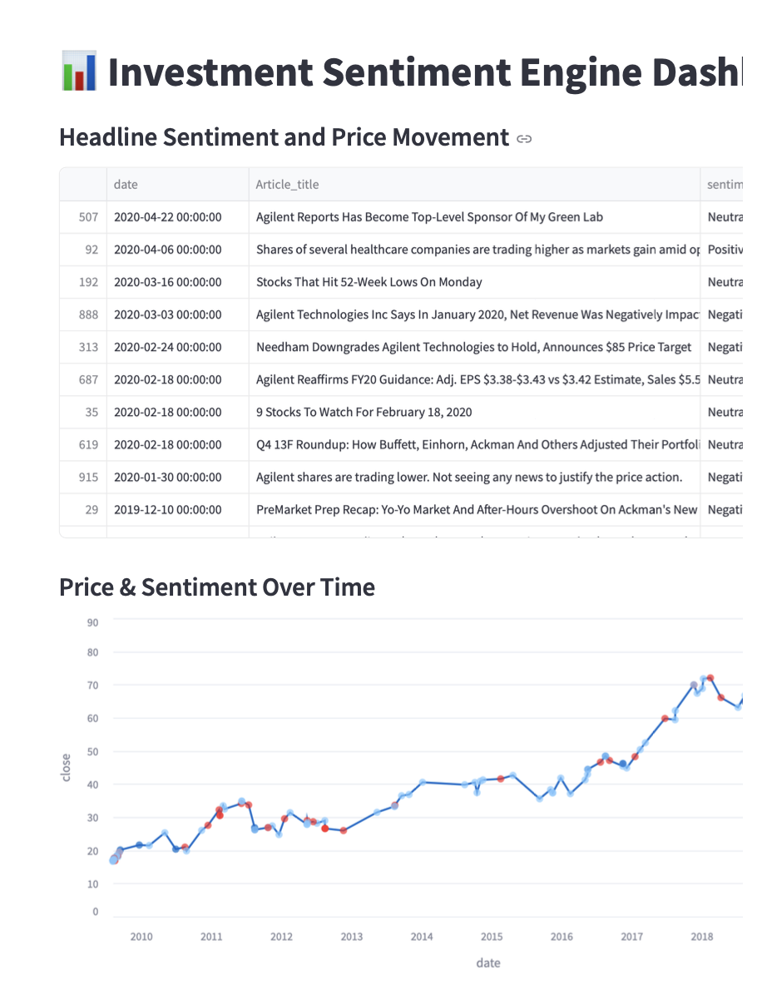

# 📊 Investment Sentiment Engine

The **Investment Sentiment Engine** is a data science project that combines natural language processing (NLP) and financial market data to evaluate how news sentiment correlates with short-term stock price movements.

It uses FinBERT, a transformer-based model trained on financial text, to analyze news headlines and predict whether the market will respond in a **bullish**, **bearish**, or **neutral** way the next day.

---

## 🚀 Features

- ✅ Stream financial news headlines using Hugging Face datasets (FNSPID)
- ✅ Fetch historical stock price data using `yfinance` (SPY + others)
- ✅ Apply **FinBERT** to extract sentiment from financial headlines
- ✅ Label returns as **Bullish**, **Bearish**, or **Neutral**
- ✅ Train models to predict price signals from sentiment
- ✅ Backtest a trading strategy based on sentiment polarity
- ✅ Deploy an interactive **Streamlit dashboard** to explore the results

---

## 📁 Project Structure

```
├── sentiment_dashboard.py       # Streamlit app
├── sample_df.csv                # Merged news + sentiment + price data
├── Investment_Sentiment_Engine.ipynb  # Colab notebook (full pipeline)
├── requirements.txt             # Python dependencies
```

---

## 📊 Dashboard Preview



---

## ⚙️ Requirements

Install dependencies:

```bash
pip install -r requirements.txt
```

Or manually:

```bash
pip install yfinance datasets transformers scikit-learn matplotlib altair streamlit
```

---

## 💡 Usage

### ▶️ Run Locally
```bash
streamlit run sentiment_dashboard.py
```

### 🌐 Deploy to Streamlit Cloud
- Push this repo to GitHub
- Go to [streamlit.io/cloud](https://streamlit.io/cloud)
- Connect your GitHub and deploy

---

## 📈 Strategy Logic

- If sentiment is **positive** → Buy → Hold 1 day → Track return
- If **negative** → Short-sell → Track reverse return
- **Neutral** → No position

---

## 📚 Dataset Sources

- 📉 [Yahoo Finance (SPY)](https://finance.yahoo.com/quote/SPY)
- 📰 [FNSPID News Dataset (Hugging Face)](https://huggingface.co/datasets/Zihan1004/FNSPID)
- 🧠 [FinBERT Tone](https://huggingface.co/yiyanghkust/finbert-tone)

---

## 👩‍💻 Author

**Janhavi Patil**  
Graduate Student, Northeastern University  
📫 [LinkedIn](https://linkedin.com/in/janhavipatil) | ✉️ patil.janhavi@northeastern.edu

---

## 📌 License

This project is for academic and educational purposes only.
